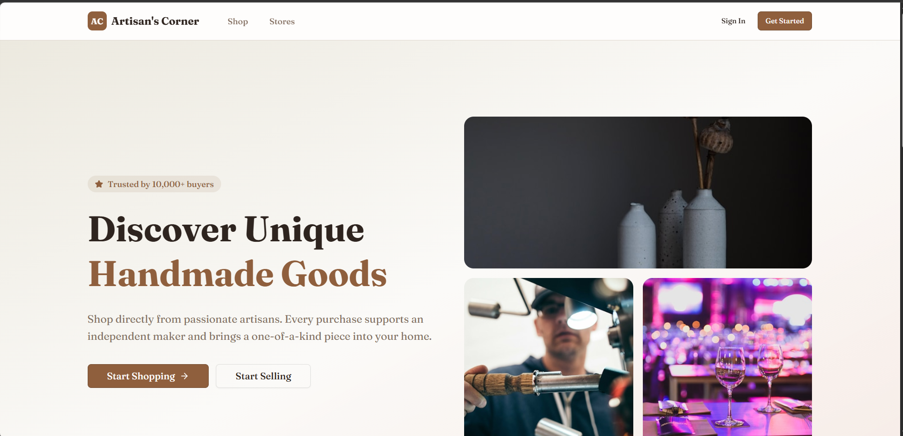

# 🎨 Artisan's Corner


## Handmade Goods Marketplace

Artisan's Corner is a modern marketplace landing page designed to connect customers with passionate artisans and independent makers. The platform focuses on handmade goods, unique products, and a clean shopping experience.



## 🚀 Current Features

* Premium landing page UI
* Handmade product marketplace concept
* Customer and seller call-to-action buttons
* Clean navigation with Shop and Stores sections
* Responsive layout design
* Artisan-focused branding and visual identity

| Feature           | Status        |
| ----------------- | ------------- |
| Landing Page      | ✅ Implemented |
| Shop Page         | 🚧 Planned    |
| Stores Page       | 🚧 Planned    |
| Seller Onboarding | 🚧 Planned    |
| Product Catalog   | 🚧 Planned    |
| Shopping Cart     | 🚧 Planned    |

## 💡 Project Vision

Artisan's Corner aims to support independent makers by providing a digital platform where they can showcase handmade products and connect directly with buyers.

## 🛠️ Tech Stack

* Next.js
* React.js
* TypeScript
* Tailwind CSS
* Git
* GitHub

## 🧠 Planned Architecture

```text
Customer / Artisan
        │
        ▼
Next.js Frontend
        │
        ▼
Marketplace Pages
        │
        ▼
Product Catalog & Seller Features
        │
        ▼
Future Backend / Database Integration
```

## 🔮 Future Enhancements

* Product listing page
* Individual store pages
* Seller registration
* Product upload system
* Shopping cart
* Wishlist
* Secure checkout
* Order tracking
* Admin dashboard

## 📌 Resume Summary

Developed a modern handmade goods marketplace landing page using Next.js, React.js, TypeScript, and Tailwind CSS with a premium responsive UI focused on connecting customers with independent artisans.

## 👩‍💻 Author

**Matam Litika**

GitHub: https://github.com/matamlitika07-oss
LinkedIn: https://www.linkedin.com/in/matam-litika

